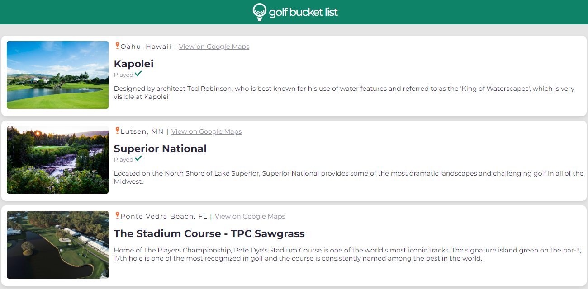

# Golf Journal
> My favorite sport, in my favorite places.

## Table of Contents
* General info
* Demo
* Technologies
* Setup
* Features
* Inspiration
* Contact

## General Info
Golf Journal is a simple app I made to get some practice in with React props, as well as help keep track of some of my bucket list courses.

<div align="center">Golf Journal</div>
<br/>
<div align="center">
<kbd>

</kbd>
</div>

## Project Demo
[Click to view site](https://golf-travel-journal.netlify.app)

## Technologies
* HTML5
* CSS3
* Bootstrap
* React - version 18.2
* React-Dom - version 18.2
* React-Scripts - version 5.0.1

## Setup
To try this project out yourself:
1. Clone this repository to your computer
2. In the command line, navigate to the root directory and type:
  $ npm install
3. Then type:
  $ npm start
4. Navigate to http://localhost:3000 in your browser

## Code Example
### React.js
```javascript
const Card = (props) => {

    return (
        <section className = "card">
            <div className = "card__left">
                
            </div>
            <div className = "card__right">
                <p className="card__location"> {props.course.location} <span>|</span> <a href={props.course.googleMapsUrl} className="card__mapsUrl" target="_blank" rel="noreferrer">View on Google Maps</a></p>
                <h1 className="card__title">{props.course.title}</h1>
                {/*Only displays if isPlayed == true in data.js*/}
                {props.course.isPlayed && <p className="card__played">Played </p> }
                <p className="card__description">{props.course.description}</p>
            </div>
        </section>
  )
}
```
## Status
Project is: finished, but we likely be built out to include full CRUD functionality and backend database connection.

## Inspiration
This project was inspired by the combination of my two favorite things to do in my free time; travel the world, and play golf. I seldom travel to a new place without my golf clubs, and this app will help me keep track of the places I've played and have yet to play.

## Contact
Created by Cole Robinson (https://www.linkedin.com/in/cwrobinson-/)
Let me know what you think! All feedback welcome.

## License
[Click to view](https://github.com/Col-R/golfbag_builder/blob/master/LICENSE.md)
